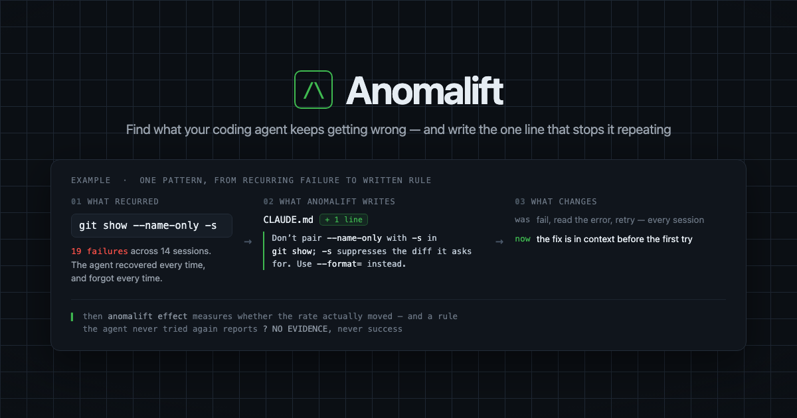

<p align="center">
  
</p>

<p align="center">
  <a href="#install"><b>Install</b></a> ·
  <a href="#the-loop"><b>The loop</b></a> ·
  <a href="#what-it-writes-to-disk"><b>What it writes</b></a> ·
  <a href="#privacy"><b>Privacy</b></a> ·
  <a href="BETA.md"><b>Beta guide</b></a>
</p>

<p align="center">
  <sub>Apache-2.0 · no network calls · one binary, under 1MB</sub>
</p>

---

Your coding agent fails a tool call, recovers, and forgets. Next week it makes
the same call, fails the same way, and recovers again. Nothing in the loop
remembers.

`anomalift` reads the transcripts your agent has already written, finds the
failures that **recur across sessions**, and writes a one-line rule into
`CLAUDE.md` for the ones it has a known fix for — so the fix is in context
before the first try instead of after the failure. Then it measures what
happened to the failure rate.

- **Nothing is written without your say-so.** `apply` shows a diff and asks,
  copies the file to a backup first, and `forget` puts it back exactly.
- **No rule without a known fix.** Patterns with no unambiguous remedy are
  reported and left to you to word, never invented into advice.
- **Rates, not counts.** Every pattern carries a denominator, so an abandoned
  command cannot look like a cure.
- **No network calls.** Local files in, local files out.

---

## Install

**With Node** — works anywhere, no Rust and no toolchain:

```sh
npx anomalift
```

That fetches one prebuilt binary for your platform and runs it. `npm install -g
anomalift` if you would rather not re-resolve it on every run. Nothing is
compiled on your machine, and no install script runs.

Supported: macOS (Apple Silicon and Intel), Linux (x86-64 and arm64, built
against musl so a glibc version mismatch cannot bite), Windows x86-64 — and
Windows on ARM, which runs the x64 build under the OS's own emulation.

**Direct download** — the shell installers below fetch a binary from the GitHub
release and verify it against the published SHA-256, refusing to install on a
mismatch. They need the repository to be public, so while it is private they
will not resolve and `npx` is the route to use.

```sh
# macOS / Linux
curl -fsSL https://raw.githubusercontent.com/kailash16dev/Anomalift/main/install.sh | sh

# Windows (PowerShell)
irm https://raw.githubusercontent.com/kailash16dev/Anomalift/main/install.ps1 | iex
```

`install.sh` honours four environment variables, and `install.ps1` honours the same:

| variable | default | meaning |
|---|---|---|
| `ANOMALIFT_REPO` | the upstream repo | which GitHub repo to download releases from |
| `ANOMALIFT_VERSION` | `latest` | a specific release tag |
| `ANOMALIFT_BIN_DIR` | `$HOME/.local/bin` | where to put the binary (`%LOCALAPPDATA%\Programs\anomalift` on Windows) |
| `ANOMALIFT_SKIP_CHECKSUM` | unset | install without verifying the download |

It installs one file, `anomalift`, into `ANOMALIFT_BIN_DIR`. It does not need
root, does not edit your shell profile, and prints the `export PATH=...` line
for you to run yourself if the directory is not already on your `PATH`.

**The binaries are unsigned.** On macOS the installer strips the quarantine
attribute from the file it just downloaded, so installing this way does not
produce a Gatekeeper dialog. A binary downloaded by hand from the releases page
will produce one; see [BETA.md](BETA.md) for the exact fix on macOS and
Windows.

**From source** (Rust 1.90 or newer):

```sh
cargo build --release   # target/release/anomalift
```

---

## The loop

### 1. `anomalift` — find what recurs

```
$ anomalift --sessions 120

  Anomalift
  120 sessions · 166 failed tool calls · 114 with a readable error

  Your agent has repeated failures.

    44% of readable failures are recurring
    5 recurring patterns found
    4 have a known fix

  Top opportunities:
    git show      19 failures    fix known
    Grep          13 failures    fix known
    Read          11 failures    fix known
    cd            8 failures     fix known
    find          6 failures     no known fix

  Run:
    anomalift apply      Apply proven fixes to your agent
    anomalift --all      Show every pattern, with the raw error
```

*(Shape of the output, not a claim about yours. The recurrence rate is measured
on your own transcripts and printed on every run, rather than quoted from
someone else's machine.)*

Reads the newest `--sessions` transcripts (default 120), normalises each error
into a signature, and groups them. A pattern is only called *recurring* if it
clears both thresholds:

- **3 or more occurrences.** A rule written from one incident is superstition.
- **in 2 or more sessions.** Ten failures in one afternoon is one bad
  afternoon. The same failure across separate sessions is a habit, and only
  habits deserve a standing instruction.

Two classes of failure are dropped before any of that:

- **Failures with no message.** `Exit code 1` on its own is typically the
  largest single bucket, and would produce a rule that says nothing.
- **Failures the user caused.** "The user doesn't want to proceed", "Request
  interrupted by user", and similar. Turning a rejected tool call into a
  standing rule would train the agent on your own decisions.

`anomalift --all` shows everything, including patterns below the thresholds.
`anomalift --json` emits the same data as JSON. `anomalift --project <name>`
narrows to one project's sessions.

### 2. `anomalift apply` — write the rules

Shows a diff and asks before touching anything.

```
$ anomalift apply --dry-run

  CLAUDE.md

  +
  + <!-- anomalift:begin 2026-09-06 -->
  + <!-- Added by anomalift from repeated failures. `anomalift forget` removes this block. -->
  + - Do not combine `--name-only`/`--name-status` with `-s` in `git show`; `-s` suppresses the diff that `--name-only` asks for. Use `git show --name-only --format=` instead. (19× in 14 sessions)
  + - Pass ripgrep's own type names to `Grep`'s `type` argument, not file extensions: `ts` already covers `.tsx`, and `js` covers `.jsx`. `rg --type-list` is the full set; for anything not in it use `glob` (e.g. `*.tsx`) instead. (13× in 9 sessions)
  + - Check a path is a file before reading it; use `ls` or `Glob` for directories. (11× in 10 sessions)
  + - Confirm a directory exists before `cd`; prefer absolute paths in `Bash`. (8× in 5 sessions)
  + <!-- anomalift:end -->

  dry run — nothing written
```

Only the marked block is ever touched; everything outside the two markers is
preserved byte for byte. The previous file is copied to
`CLAUDE.md.anomalift-backup-<timestamp>` first, and the new content is written
to a temporary file and renamed, so a crash mid-write cannot leave you with a
truncated `CLAUDE.md`.

If the markers in your file do not make sense — a stray begin with no end, two
blocks, an end before a begin — `apply` refuses and exits non-zero rather than
guessing. A marker inside a fenced code block is not treated as a marker, so
you can document `anomalift` in your own `CLAUDE.md` without it rewriting your
example.

`--yes` skips the prompt for scripting. It is not the default, and a
non-interactive stdin answers *no* rather than yes.

**`apply` writes far fewer rules than the scan reports, on purpose.** It only
writes a rule where the fix is unambiguous and general, from a small hardcoded
table of remedies checked against real transcripts. In the run above, five
patterns recurred and four had a written remedy. A pattern with no known fix is
reported by the scan and never written, because a confidently wrong line in
`CLAUDE.md` misleads the agent on every future turn — which costs more than the
failure it was trying to prevent.

Those unruled patterns are not discarded. `apply` freezes them as a **control
arm**: they recurred, they cleared the same thresholds, and no rule was written
for them. Their later movement is what ordinary drift looks like with no rule
involved, which is the only way to tell a working rule from regression to the
mean.

### 3. Keep working

Nothing to do. `effect` reads sessions recorded after the rules were written.

### 4. `anomalift effect` — did it work?

```
$ anomalift effect
```

Compares failure *rates*, not counts. Every pattern gets a denominator: the
number of times the agent attempted the kind of thing that could have failed.
For `Bash` that is the leading words of the command, so `git diff` and
`git commit` are different opportunities; for other tools it is the tool name.

Rates rather than counts because a raw before/after count is confounded by
usage. If a rule is added for some command and the agent then simply stops
using that command, failures drop to zero and the rule looks like a cure. With
a denominator, that case reports zero attempts and `NO EVIDENCE`.

Four verdicts, printed in the same weight:

| verdict | meaning |
|---|---|
| `WORKS` | the rate fell, and the fall clears a Holm-corrected significance test |
| `UNPROVEN` | the rate fell, but not enough to distinguish from chance at this sample size |
| `NO EVIDENCE` | the agent never attempted it again, so the rule was never tested |
| `NO IMPROVEMENT` | the rate did not fall, or rose |

Verdicts are earned rather than assumed. Straight after `apply` the "after"
side is empty, so patterns report `NO EVIDENCE` until normal work has given the
agent the chance to attempt those same commands again — a couple of weeks of
sessions is typical. `anomalift` reports `NO EVIDENCE` instead of claiming a win
it cannot support.

Only `WORKS` is ever credited with failures avoided or tokens saved. Everything
else claims zero — in the terminal output and in `--json` alike, so a JSON
consumer cannot re-derive a saving the terminal deliberately suppressed.

The significance test is Fisher's exact (the counts are small enough that
chi-squared is not trustworthy), with Holm–Bonferroni correction because
hundreds of patterns are tested in a single run. Without the correction, a run
over a few hundred patterns turns up a "significant" result that no applied rule
could have caused.

The "before" numbers come from baselines **frozen at the moment `apply` ran**,
not recomputed, so a verdict does not shift when you change how far back you
look. `effect` ignores `--since` once frozen baselines exist, and says so.

### `anomalift forget`

Removes the block `apply` added and nothing else, leaving the file byte-identical
to its pre-`apply` state (one documented exception: a file that had no trailing
newline gains one). It also clears the frozen baselines, because measuring a
rule the agent can no longer see would report drops that cannot be the rule.

### `anomalift share`

Writes a redacted `anomalift-report.md` for a maintainer collecting beta
results. Nothing is uploaded — the file lands on disk and you decide whether to
send it. See [BETA.md](BETA.md) for exactly what is and is not in it.

---

## One other surface

Optional. The four-command loop above does not need it.

- **`anomalift mcp`** runs an MCP server (JSON-RPC 2.0 over stdio) exposing
  three tools, so the agent can consult its own failure history at the moment
  of a tool call rather than relying on a `CLAUDE.md` line read at session
  start. It reads only the cache a scan leaves behind and never touches
  transcripts, so answers are immediate. Run `anomalift` at least once first,
  or there is no cache to read.

  ```sh
  claude mcp add anomalift -- anomalift mcp
  ```

---

## What it writes to disk

Relative to the rules file (`./CLAUDE.md` unless `--file` says otherwise):

| path | written by | contents |
|---|---|---|
| `CLAUDE.md` | `apply`, `forget` | one marked block, dated; nothing outside it |
| `CLAUDE.md.anomalift-backup-<unix>` | `apply`, `forget` | the file exactly as it was before the write |
| `.anomalift/learned.json` | `apply`, `forget`, `effect` | frozen baselines, rules, controls, and a dated measurement per run |
| `.anomalift/patterns.json` | the scan | derived cache, for `mcp` |
| `./anomalift-report.md` | `share` | the redacted report (`--out` to change) |

`.anomalift/learned.json` is pretty-printed on purpose: it is a file you may
need to read to understand why a verdict came out the way it did, and it lands
in a repository where a diff should be legible.

Nothing else on your machine is modified. Transcripts are read, never written.

---

## Privacy

- **No network calls.** There is no HTTP client in the binary. Its direct
  dependencies are `anyhow`, `clap`, `serde` and `serde_json`, resolving to 29
  crates in total — none of which can open a socket.
- **Reads** `~/.claude/projects/**/*.jsonl` — transcripts Claude Code has
  already written to your disk.
- **Writes** only the files in the table above.
- **`share` is the only thing designed to leave your machine**, and it leaves
  by hand: the report is written to disk and you choose whether to send it. Its
  redaction is an allow-list, not a deny-list — only fields known to be safe are
  emitted. No file paths, no queries or task descriptions, no error text, no
  repository or project names, no usernames.

---

## Known limits

- **Claude Code only.** The CLI and the VS Code extension write the same
  transcript format, so one reader covers both. Codex and Cursor are not
  supported: Codex's on-disk format is mid-migration, and Cursor stores
  conversations in an undocumented SQLite blob that changes between releases.
  A reader written against a guessed format appears to work and silently drops
  data.
- **Six remedies.** The table of known fixes covers unknown `Grep` file types,
  malformed search regexes, `git show` flag conflicts, unknown git revisions,
  `Read` on a directory, and `cd` into a missing path. Everything else is
  reported and left to you to word.
- **Rules are project-local, patterns are not.** The scan reads every project's
  sessions unless you pass `--project`, but `apply` writes to the `CLAUDE.md` in
  your current directory. If you want per-project rules, pass `--project`.
- **The token figure is not configurable.** `TOKENS_PER_FAILURE` is a fixed
  median from transcript history and multiplies into every "tokens saved" number
  printed.

---

## License

Apache-2.0 — see [LICENSE](LICENSE).
